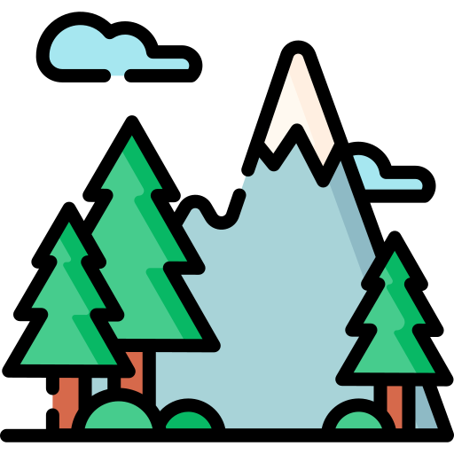
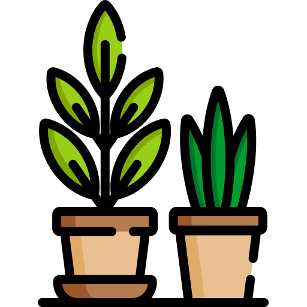

<h2>
  <code>Hi there!</code>
  
</h2>

<h4>Maria Markowiak · Fullstack Engineer · Wrocław, PL</h4>

<em>Usually somewhere between figuring things out and making them work.</em>

<h2></h2>  

### Stack

Backend

Frontend

Tools & Infrastructure

<h2></h2>  

 

 hiking &nbsp;&nbsp;  gardening &nbsp;&nbsp;  volunteering

 

**to celebrate whatever ships today:**

    

  

icons by Freepik from flaticon.com
